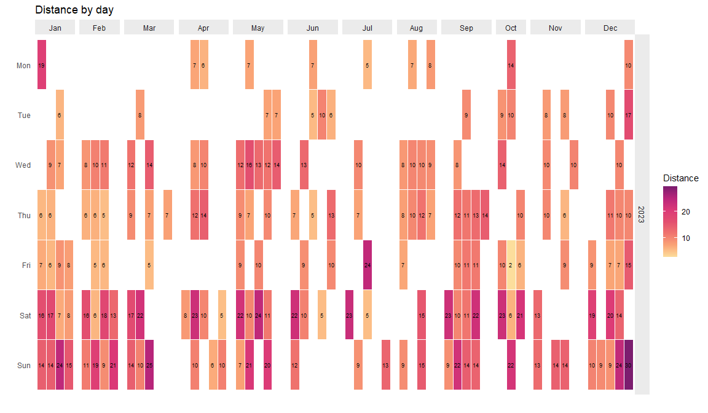

My Strava (two) year(s) in review
================

# Overview

A couple (or few?) years ago, I did [a Strava years in
review](https://github.com/derekbeaton/pin_strava/). I didn’t do one
last year and really wanted to do one for this year. That’s because this
year had a whole bunch of interesting races and personal bests. Plus I
needed an excuse to write some code again because I don’t really get to
do that anymore.

In this review—of 2022 and 2023—I recreate some of what Strava provides
to subscribers (which is not me!) for the yearly summary, and some of
what Strava non-subscribers see monthly. And I’ve thrown in some of my
own types of summaries.

# A bit of background

The previous version of the review was, perhaps, a bit overkill. It used
the Strava API, `targets`, and I had generated a bunch of images saved
to a folder and then re-loaded them. This year I took a slightly easier
approach (detailed a little bit below):

- I have one “real” R script and one “scratch pad”:

  - The “real” one is `./code/0_get_initial_data.R`

  - I only used `./code/1_cleaning_checking.R` as a place to gather
    thoughts, try things out, and keep some terrible notes.

- The bulk of summary and visualization is entirely within this `README`
  and a file with functions (`./code/functions.R`)

To do what I’ve done here:

- Make sure you have access to the Strava API and use `rStrava` to pull
  data

- I have a `.Renviron` file—not uploaded to this repository because it
  has secrets—that contains `STRAVA_KEY` (API client digits),
  `STRAVA_SECRET` which is a long key to access the API, and
  `ATHLETE_ID` which is my ID (profile number).

- When running `./code/0_get_initial_data.R`, it opens a browser and
  then you have to authorize (confirm) via Strava that you’re allowing
  the use of the API and getting access authenticated

- Then `./code/0_get_initial_data.R` will run, do a bit of clean up, and
  save a `.rda` file to `./data/`

- That .`rda` file is also not uploaded here because it contains very
  detailed information (latitude, longitude, athlete ID and more)

- That `.rda.` file is loaded here in this `README.Rmd` and then used
  for all subsequent visualization and analyses.

# The review(s)

Let’s get cracking. So how have things been going in 2022 and 2023?
Let’s find out, for each year:

- How many runs I did

- How many kilometers I ran

- How much time I spent running (Strava continuously recording)

<table class="table" style="margin-left: auto; margin-right: auto;">
<thead>
<tr>
<th style="text-align:right;">
Year
</th>
<th style="text-align:right;">
Number of runs
</th>
<th style="text-align:right;">
Total kilometers
</th>
<th style="text-align:right;">
Total moving hours
</th>
</tr>
</thead>
<tbody>
<tr>
<td style="text-align:right;">
2022
</td>
<td style="text-align:right;">
183
</td>
<td style="text-align:right;">
1583.561
</td>
<td style="text-align:right;">
139.3708
</td>
</tr>
<tr>
<td style="text-align:right;">
2023
</td>
<td style="text-align:right;">
230
</td>
<td style="text-align:right;">
1999.459
</td>
<td style="text-align:right;">
175.6208
</td>
</tr>
</tbody>
</table>

Let’s now find out what my longest (in kilometers) runs were. We’re also
going to see when I started the run, which day, how far, and how much
time I spent running.

<table class="table" style="margin-left: auto; margin-right: auto;">
<thead>
<tr>
<th style="text-align:right;">
Year
</th>
<th style="text-align:left;">
Start datetime
</th>
<th style="text-align:left;">
Day of the week
</th>
<th style="text-align:right;">
Distance
</th>
<th style="text-align:right;">
Moving time
</th>
<th style="text-align:right;">
Total elevation
</th>
</tr>
</thead>
<tbody>
<tr>
<td style="text-align:right;">
2023
</td>
<td style="text-align:left;">
2023-12-31 13:09:40
</td>
<td style="text-align:left;">
Sun
</td>
<td style="text-align:right;">
29.65
</td>
<td style="text-align:right;">
3.02
</td>
<td style="text-align:right;">
85.2
</td>
</tr>
<tr>
<td style="text-align:right;">
2022
</td>
<td style="text-align:left;">
2022-01-16 15:42:56
</td>
<td style="text-align:left;">
Sun
</td>
<td style="text-align:right;">
24.70
</td>
<td style="text-align:right;">
2.29
</td>
<td style="text-align:right;">
60.3
</td>
</tr>
</tbody>
</table>

Let’s pause here for some commentary (that’s why you’re here, right?)!

I had been tracking myself in 2023 quite a bit especially in the end of
the year. Sometime in early December I realized I *could* hit 2,000km if
I put a smidgen more distance into every remaining run of the year. But
as we can see, I didn’t do that and just went all out on the very last
day of the year to get to 2,000km (1,999km counts as 2,000km leave me
alone).

Something I’ve been curious about—which is not provided by Strava in
review, but *sort of* in the activities interface—is which week was my
biggest week and how much was it? Before we find out this is where we
learn about how stupid time is.

Time is dumb. When trying to map out each week, various functions in
`base` and `lubridate` like to count days and weeks from reference
points I don’t want! So my December 31, 2023 run ended up in “week 53”
of the year. Not only that, weeks weren’t counting like Strava counts
weeks: Start on Monday and end on Sunday.

With the help from *a lot* of StackExchange posts, the following line of
code is how I ended up ensuring that: (1) weeks start on Mondays, and
(2) every day of the year falls into weeks \[1-52\]:

``` r
mutate(wk = lubridate::epiweek(floor_date(as.Date(start_date_local)-1, "weeks")))
```

OK so back to the running parts. The next table tells us which week I
ran the most each year and how much:

<table class="table" style="margin-left: auto; margin-right: auto;">
<thead>
<tr>
<th style="text-align:right;">
Year
</th>
<th style="text-align:right;">
Week (number)
</th>
<th style="text-align:right;">
Total kilometers
</th>
</tr>
</thead>
<tbody>
<tr>
<td style="text-align:right;">
2022
</td>
<td style="text-align:right;">
33
</td>
<td style="text-align:right;">
62.73
</td>
</tr>
<tr>
<td style="text-align:right;">
2023
</td>
<td style="text-align:right;">
52
</td>
<td style="text-align:right;">
80.68
</td>
</tr>
</tbody>
</table>

## Monthly summaries

In Strava’s yearly review—for subscribers, of which I ain’t—you’d see
summaries at the monthly level for distance, time, and elevation. Let’s
see what my summaries were for both 2022 and 2023:

First up we’ll look at total monthly distances:

<!-- -->

Now total time:

<!-- -->

And finally elevation gain:

<!-- -->

From the above we can also see which months I really ramped up training
and the subsequent race months in 2023:

- In May I upped distance, speed work, hills, and just more running than
  almost any other month because June and July were packed with races:

  - I did the Ekiden relay with current (and one former!) members of
    Data Science & Advanced Analytics
    [(DSAAmigos!)](https://results.raceroster.com/v2/en-CA/results/tejhkrv9x2qcw2h7/results)

  - [Toronto Pride & Remembrance Run](https://www.priderun.org/results)
    where I hit my 5k PB

  - and in July 2023 things got weird! I did the [Ragnar Pacific
    Northwest](https://www.webscorer.com/race?raceid=321425) with a
    [bunch of great
    pals](https://photos.runragnar.com/galleries/64a6fba3e9572e7ce2c372ce)

- In September I upped distance and generally consistency with running
  because I had two races in October:

  - The best and weirdest running decision I’ve made: [shooting for and
    getting the world record for fastest 5 person costume half
    marathon](https://runningmagazine.ca/the-scene/toronto-running-quintet-sets-guinness-world-record-in-ttc-streetcar-costume/).
    See the end of this post for a lot more about this

  - A RunTOBeer outing (take over) of the [Ellicottville EVL
    half](https://scorethis-results.com/Results.php?raceid=20231021EVLH)
    where I hit my half marathon PB

- In December 2023 I’ve upped distance and time because I’ve yet again
  been tricked into doing the Around the Bay. A race I don’t
  particularly enjoy yet here we are again

## Niche summaries

In my [previous version of my year(s) in
review](https://github.com/derekbeaton/pin_strava/), I broke down my
running into more niche and specialized summaries and visualizations
than Strava does. Those include things like time of day and full year
calendar heatmaps. So let’s do that again! But this time around, we’re
only going to do 2023.

### Proportions of run type

Like the previous review, I want to break my runs down into categories
based on distances. Those are:

- Less than or equal to 1 kilometer (“\<= 1km”): These are usually
  workouts or “specialty races” (e.g., relay version of a beer mile).

- Between 1 and 5 kilometers (“1-5 km”): These are almost always
  either (1) a slow warm up or cool down or (2) a fast workout

- Between 5 and 10 kilometers (“5-10 km”): My go-to when I just want to
  run, or when I really really don’t want to run but “I have to”

- Between 10 and 15 kilometers (“10-15 km”): I like to use these to
  pretend I’m doing a long run (these are not long runs).

- Between 15 and 18 kilometers (“15-18 km”): My typical range for “long
  runs”. This is because I don’t really like running for very long
  distances: I enjoy half marathons and that’s about it.

- Between 18 and 21 kilometers (“18-21 km”): The more appropriate range
  for long runs for the types of training I go for (half marathons and
  5ks)

- Between 21 and 24 kilometers (“21-24 km”): Often someone has tricked
  me into running this distance or I’ve committed to something I grumble
  about.

- More than 24 kilometers (“24+ km”): I was definitely tricked into
  these and as soon as I get back home I just lay down on the floor
  because my brain just stops working

<!-- -->

Above helps highlight what my usual Strava recordings are: typically
5-10km at a time, followed by 10-15km.

### What times of day do I typically run?

<!-- -->

And like previous years, my runs are typically after work (late in the
5pm hour or around 6pm) but on weekends I’ll get out “early” (between 9
and 11am)

### What did my entire year look like?

Let’s now look at *every day* of 2023 as a heatmap for distance, time,
and elevation

<!-- -->

<!-- -->

From the above we can see I put my distance/time in on weekends and,
more importantly, I don’t really run on Mondays and Tuesdays. That’s
likely because I have a hybrid work schedule: Mondays and Tuesdays I’m
in office and when I get home, rarely want to run. Which has another
unintended consequence: I have to load up all my running 5 days in a
row. I’m not a smart runner.

# Conclusions

- Compared to the previous version, this was much easier. We didn’t need
  `targets` and a lot of the other bells and whistles.

- *Anecdotal for myself*: Training for long distance races and other
  endurance races (e.g., Ragnar) makes me faster on short distances
  (e.g., 5k)

- If you ever have the chance to obtain a world record you absolutely
  should do that without thinking twice (I did think twice, which is
  silly)

## Lots of extra nonsense about the world record

- We got a lot of media coverage

  - On CBC [before](https://www.cbc.ca/player/play/2272860227509) and
    [after](https://www.cbc.ca/listen/live-radio/1-82-here-and-now-toronto/clip/16016384-a-five-person-streetcar-ran-waterfront-half-marathon-breaks)
    the race. I’ve never run a full marathon before but, apparently we
    could be contenders for the same costume and someone commmitted us
    to it live on the air. I can’t back down now

  - [Official
    record](https://www.guinnessworldrecords.com/world-records/416044-fastest-half-marathon-in-a-five-person-costume).
    Previous record was held by a Danish catepillar

  - Various social media shout outs

    - [RunTOBeer](https://www.instagram.com/p/Cy3q-oOAp1S/?img_index=1)

    - Someone posted the [RunTOBeer cheering station to
      Reddit](https://www.reddit.com/r/toronto/comments/178jls9/run_like_the_ttc_made_you_late/)

    - [Athletic
      Brewing](https://www.instagram.com/athleticbrewing/p/Cy3miZrrSRS/)
      which was one of our sponsors

    - My [Twitter
      thread](https://twitter.com/derek__beaton/status/1713219875030671615)
      that starts with a behind the scenes of the first CBC interview

    - Annex Cat Rescue [shout
      out](https://twitter.com/annex_cat/status/1721603357767262406) for
      our fund raising efforts
